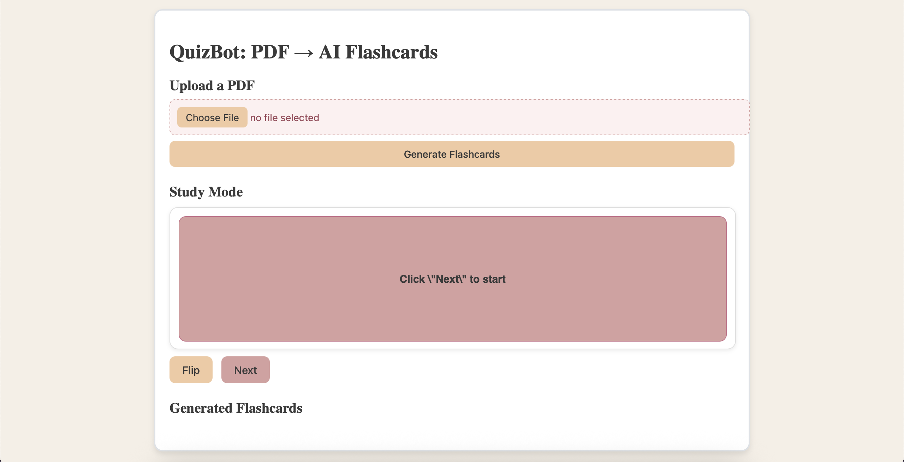
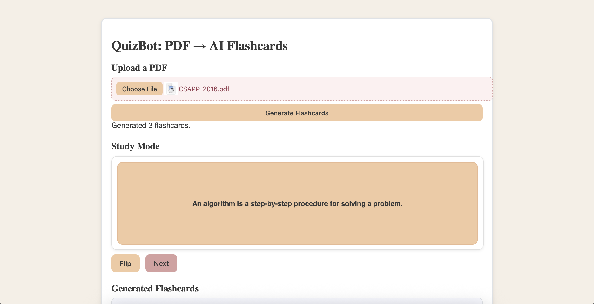
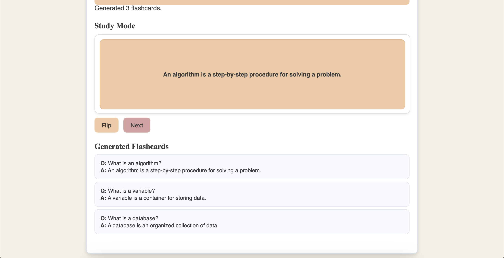

git status# QuizBot: PDF → AI Flashcards

QuizBot is a prototype web application that explores how AI could enhance learning workflows by allowing users to upload a PDF and study generated flashcards through an interactive interface.

Developed as part of a university AI exercise, the project focuses on designing and implementing the end-to-end user experience—from document upload to flashcard review. The current prototype demonstrates the intended workflow using sample flashcard data while laying the foundation for future integration with a Large Language Model (LLM).

---

## Features

- Upload PDF documents
- Demonstrate an AI-assisted flashcard generation workflow
- Interactive study mode with flip-card functionality
- Navigate through flashcards
- View generated question-and-answer pairs
- Responsive web interface

---

## Screenshots

### Home Screen



Upload a PDF to begin the flashcard generation workflow.

---

### Study Mode



Review flashcards through an interactive study interface with flip-card functionality.

---

### Generated Flashcards



View all generated question-and-answer pairs for quick review.

---

## Technologies Used

### Frontend
- HTML
- CSS
- JavaScript

### Backend
- ASP.NET Core
- C#

---

## Project Structure

```text
quizbot-ai-flashcards
│
├── DocumentFlashcards.Frontend
│   ├── index.html
│   ├── style.css
│   └── script.js
│
├── DocumentFlashcards.Web
│   ├── Program.cs
│   ├── Flashcard.cs
│   ├── appsettings.json
│   └── ...
│
├── screenshots
│   ├── 01-home.png
│   ├── 02-study-mode.png
│   └── 03-generated-flashcards.png
│
└── README.md
```

---

## How to Run

### Backend

Navigate to the backend project:

```bash
cd DocumentFlashcards.Web
dotnet run
```

### Frontend

Open the frontend project using **Live Server** in Visual Studio Code.

Open:

```text
DocumentFlashcards.Frontend/index.html
```

The frontend communicates with the ASP.NET Core backend to demonstrate the flashcard generation workflow and interactive study interface.

---

## What I Learned

Through this project, I gained experience with:

- Building a web application with separate frontend and backend components
- Designing and prototyping an AI-assisted learning workflow
- Creating an interactive flashcard interface using JavaScript
- Connecting frontend and backend functionality
- Translating a concept into a working prototype focused on user experience
- Rapidly prototyping ideas before investing in a production-ready implementation

---

## Future Improvements

Some features I would like to add in future iterations include:

- Integrate an LLM API (e.g., OpenAI or Azure OpenAI) to dynamically generate flashcards from uploaded PDF documents
- Improve PDF parsing for longer and more complex documents
- Add user authentication and saved study sessions
- Implement spaced repetition and quiz modes
- Allow users to edit, regenerate, and export flashcards
- Improve error handling and upload validation

---

## License

This project was developed for educational purposes as part of coursework at Fairleigh Dickinson University.